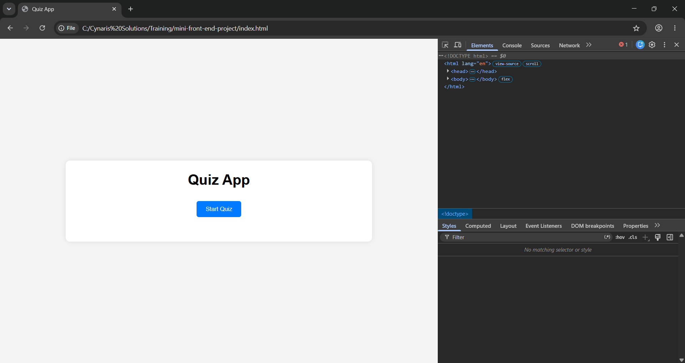
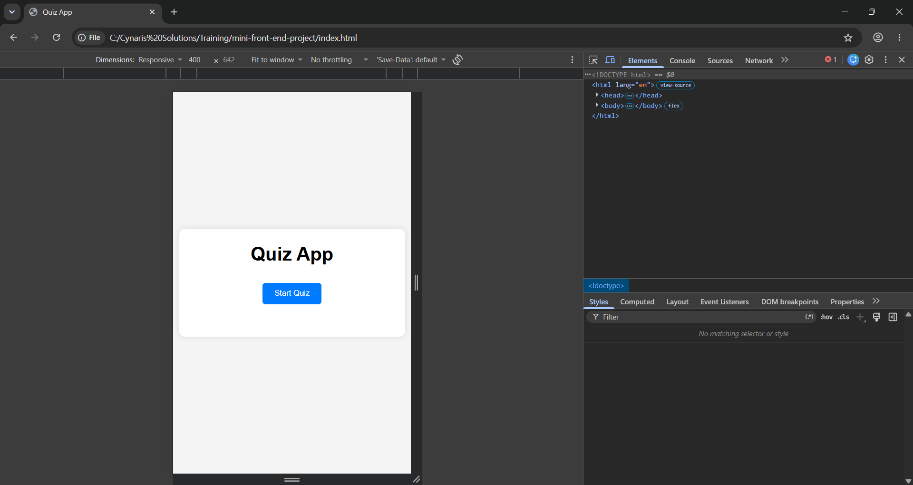

# Computer Science & India Quiz App

## Project Description
A responsive quiz application built using HTML, CSS, and JavaScript. The quiz contains Computer Science and India-related questions and provides instant score tracking.

## Features
- Multiple-choice quiz
- Score calculation
- Responsive design
- Mobile-friendly interface
- JavaScript DOM manipulation

## Technologies Used
- HTML5
- CSS3
- JavaScript (ES6)

## Screenshots

### Desktop View

### Mobile View

## Live Demo

## Author
Praveen Kumar K S